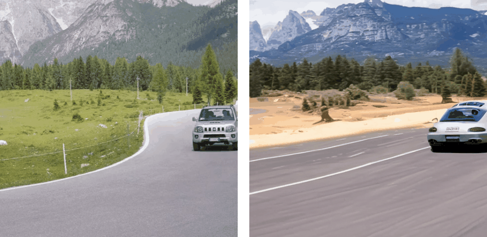
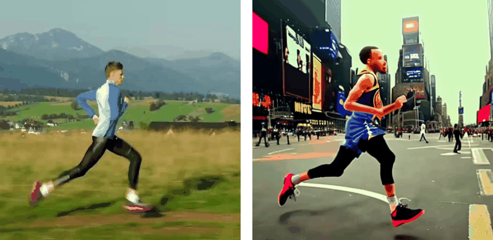
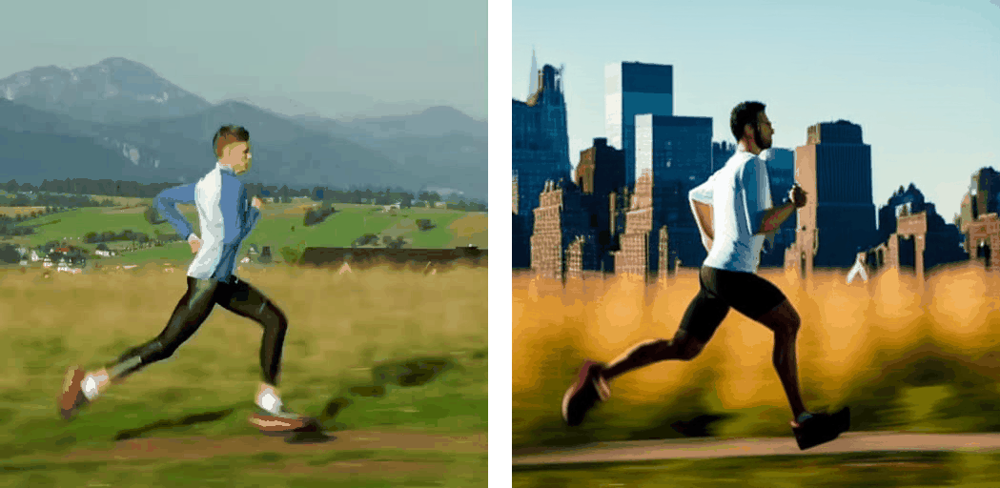
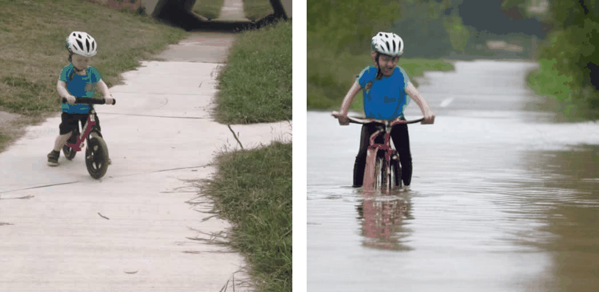
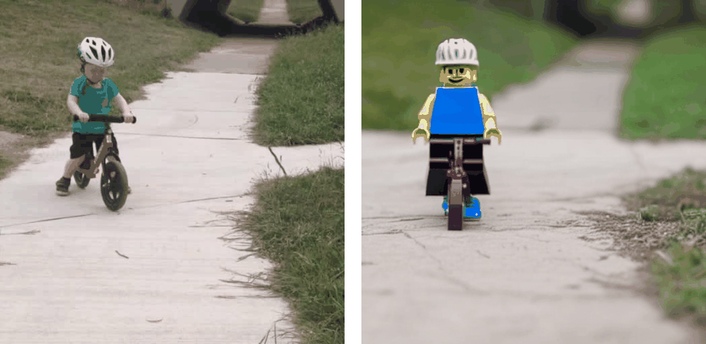
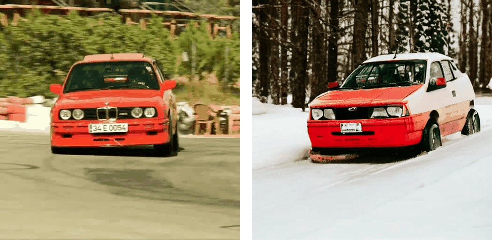
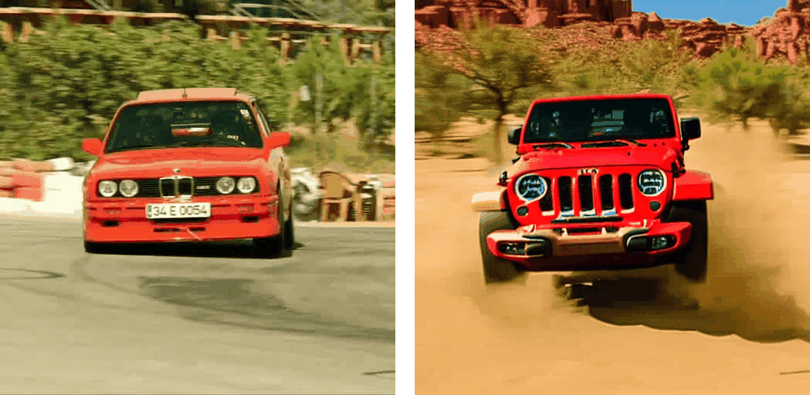

<div align="center">

<h1>vid2vid-zero for Zero-Shot Video Editing</h1>

<h3><a href="https://arxiv.org/abs/2303.17599">Zero-Shot Video Editing Using Off-The-Shelf Image Diffusion Models</a></h3>

[Wen Wang](https://scholar.google.com/citations?user=1ks0R04AAAAJ&hl=zh-CN)<sup>1*</sup>, &nbsp; [Kangyang Xie](https://github.com/felix-ky)<sup>1*</sup>, &nbsp; [Zide Liu](https://github.com/zideliu)<sup>1*</sup>, &nbsp; [Hao Chen](https://scholar.google.com.au/citations?user=FaOqRpcAAAAJ&hl=en)<sup>1</sup>, &nbsp; [Yue Cao](http://yue-cao.me/)<sup>2</sup>, &nbsp; [Xinlong Wang](https://www.xloong.wang/)<sup>2</sup>, &nbsp; [Chunhua Shen](https://cshen.github.io/)<sup>1</sup>

<sup>1</sup>[ZJU](https://www.zju.edu.cn/english/), &nbsp; <sup>2</sup>[BAAI](https://www.baai.ac.cn/english.html)

<br>

[](https://huggingface.co/spaces/BAAI/vid2vid-zero)


<image src="docs/vid2vid-zero.png" />
<br>

</div>

We propose vid2vid-zero, a simple yet effective method for zero-shot video editing. Our vid2vid-zero leverages off-the-shelf image diffusion models, and doesn't require training on any video. At the core of our method is a null-text inversion module for text-to-video alignment, a cross-frame modeling module for temporal consistency, and a spatial regularization module for fidelity to the original video. Without any training, we leverage the dynamic nature of the attention mechanism to enable bi-directional temporal modeling at test time. 
Experiments and analyses show promising results in editing attributes, subjects, places, etc., in real-world videos. 


## Highlights

- Video editing with off-the-shelf image diffusion models.

- No training on any video.

- Promising results in editing attributes, subjects, places, etc., in real-world videos.

## News
* [2023.4.12] Online Gradio Demo is available [here](https://huggingface.co/spaces/BAAI/vid2vid-zero).
* [2023.4.11] Add Gradio Demo (runs in local).
* [2023.4.9] Code released! 

## Installation
### Requirements

```shell
pip install -r requirements.txt
```
Installing [xformers](https://github.com/facebookresearch/xformers) is highly recommended for improved efficiency and speed on GPUs. 

### Weights

**[Stable Diffusion]** [Stable Diffusion](https://arxiv.org/abs/2112.10752) is a latent text-to-image diffusion model capable of generating photo-realistic images given any text input. The pre-trained Stable Diffusion models can be downloaded from [🤗 Hugging Face](https://huggingface.co) (e.g., [Stable Diffusion v1-4](https://huggingface.co/CompVis/stable-diffusion-v1-4), [v2-1](https://huggingface.co/stabilityai/stable-diffusion-2-1)). We use Stable Diffusion v1-4 by default.

## Zero-shot testing

Simply run:

```bash
accelerate launch test_vid2vid_zero.py --config path/to/config
```

For example:
```bash
accelerate launch test_vid2vid_zero.py --config configs/car-moving.yaml
```

## Gradio Demo
Launch the local demo built with [gradio](https://gradio.app/):
```bash
python app.py
```

Or you can use our online gradio demo [here](https://huggingface.co/spaces/BAAI/vid2vid-zero).

Note that we disable Null-text Inversion and enable fp16 for faster demo response.

## Examples
<table class="center">
<tr>
  <td style="text-align:center;"><b>Input Video</b></td>
  <td style="text-align:center;"><b>Output Video</b></td>
  <td style="text-align:center;"><b>Input Video</b></td>
  <td style="text-align:center;"><b>Output Video</b></td>
</tr>

<tr>
  <td width=25% style="text-align:center;color:gray;">"A car is moving on the road"</td>
  <td width=25% style="text-align:center;">"A Porsche car is moving on the desert"</td>
  <td width=25% style="text-align:center;color:gray;">"A car is moving on the road"</td>
  <td width=25% style="text-align:center;">"A jeep car is moving on the snow"</td>
</tr>

<tr>
  <td style colspan="2"></td>
  <td style colspan="2"></td>       
</tr>


<tr>
  <td width=25% style="text-align:center;color:gray;">"A man is running"</td>
  <td width=25% style="text-align:center;">"Stephen Curry is running in Time Square"</td>
  <td width=25% style="text-align:center;color:gray;">"A man is running"</td>
  <td width=25% style="text-align:center;">"A man is running in New York City"</td>
</tr>

<tr>
  <td style colspan="2"></td>
  <td style colspan="2"></td>       
</tr>

<tr>
  <td width=25% style="text-align:center;color:gray;">"A child is riding a bike on the road"</td>
  <td width=25% style="text-align:center;">"a child is riding a bike on the flooded road"</td>
  <td width=25% style="text-align:center;color:gray;">"A child is riding a bike on the road"</td>
  <td width=25% style="text-align:center;">"a lego child is riding a bike on the road.gif"</td>
</tr>

<tr>
  <td style colspan="2"></td>
  <td style colspan="2"></td>       
</tr>

<tr>
  <td width=25% style="text-align:center;color:gray;">"A car is moving on the road"</td>
  <td width=25% style="text-align:center;">"A car is moving on the snow"</td>
  <td width=25% style="text-align:center;color:gray;">"A car is moving on the road"</td>
  <td width=25% style="text-align:center;">"A jeep car is moving on the desert"</td>
</tr>

<tr>
  <td style colspan="2"></td>
  <td style colspan="2"></td>       
</tr>
</table>

## Citation

```
@article{vid2vid-zero,
  title={Zero-Shot Video Editing Using Off-The-Shelf Image Diffusion Models},
  author={Wang, Wen and Xie, kangyang and Liu, Zide and Chen, Hao and Cao, Yue and Wang, Xinlong and Shen, Chunhua},
  journal={arXiv preprint arXiv:2303.17599},
  year={2023}
}
```

## Acknowledgement
[Tune-A-Video](https://github.com/showlab/Tune-A-Video), [diffusers](https://github.com/huggingface/diffusers), [prompt-to-prompt](https://github.com/google/prompt-to-prompt).

## Contact

**We are hiring** at all levels at BAAI Vision Team, including full-time researchers, engineers and interns. 
If you are interested in working with us on **foundation model, visual perception and multimodal learning**, please contact [Xinlong Wang](https://www.xloong.wang/) (`wangxinlong@baai.ac.cn`) and [Yue Cao](http://yue-cao.me/) (`caoyue@baai.ac.cn`).
